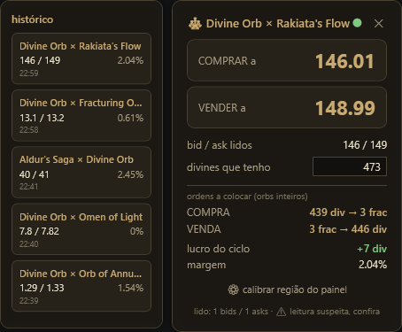

# PoE Currency Flipping Assistant

*🌐 [English](README.md) · [Português](README.pt-BR.md)*

Um overlay que **lê a tela** do **Path of Exile 2** (e, pelo layout praticamente
idêntico, provavelmente **PoE 1**) acompanhando o order book da Currency Exchange
e mostrando, em tempo real, os melhores preços de compra/venda e o lucro de um
ciclo de flip — com as ordens exatas, em orbs inteiros, pra você colocar.



> **A ferramenta só lê a tela e exibe informação.** Nunca lê a memória do jogo e
> nunca automatiza input — *você* cria as ordens. Isso a mantém na mesma categoria
> de ferramentas como o Awakened PoE Trade e dentro dos Termos de Serviço da GGG.

## Funcionalidades

- **Captura + OCR ao vivo** do painel da exchange (`Windows.Media.Ocr`), com
  pré-processamento de imagem (ampliação + escala de cinza + contraste) pra fonte
  pequena do jogo ser lida bem.
- **Qualquer par de moedas** — os nomes são raspados da tela por posição, sem lista
  fixa.
- **Ordens em orbs inteiros** dimensionadas pelo seu orçamento: mostra exatamente
  quanto dar e receber em cada ordem (ex.: `430 Divine → 30 Fracturing`).
- **Consciência de stock** — ignora ordens-poeira (volume mínimo) e avisa quando o
  topo do book é "fininho", pra um outlier solitário não enganar o veredito.
- **Alertas**: spread fechado, margem baixa demais pro custo em gold, leitura de
  OCR suspeita.
- **Histórico por par** das suas últimas leituras.
- Overlay transparente e click-through; hotkeys globais; ícone na bandeja;
  calibração de um retângulo.

## Como funciona o flip

O painel de ratios mostra o order book do lado **oposto** ao da ordem que você está
criando:

| Valor | Fórmula |
| --- | --- |
| Preço de compra | melhor bid **+** tick — fura a fila dos compradores |
| Preço de venda | menor ask **−** tick — corta os vendedores por baixo |
| Quantidade | `floor(orçamento ÷ preço de compra)` |
| Lucro do ciclo | `quantidade × (venda − compra)` |

Os alertas disparam quando o spread está fechado, a margem está abaixo de ~0,7%
(o gold come o lucro), ou a leitura parece não confiável.

## Como rodar

Requer o [.NET 8 SDK](https://dotnet.microsoft.com/download/dotnet/8.0) (Windows).

- Dê **duplo-clique no `run.bat`** — ele recompila e abre o overlay.
- Ou pelo terminal: `dotnet build src\PoE2FlipOverlay.App` e rode o
  `PoE2FlipOverlay.exe` gerado.

**No jogo:** abra a Currency Exchange com a lista de ratios visível, então aperte a
tecla de captura no lado de compra (`Num4`) e no lado de venda (`Num5`). Alterne
entre click-through / interativo com `Ctrl+Shift+F`. As configurações ficam no
`config.json`, ao lado do executável.

## Compilar e testar

```bash
dotnet test        # compila e roda os testes do Core (multiplataforma)
```

A biblioteca `Core` (parsing, contas do flip, dimensionamento de ordens, detecção
de moedas) é multiplataforma e coberta por testes xUnit. O app WPF e o OCR miram
`net8.0-windows` e só compilam no Windows.

## Estrutura do projeto

```
src/PoE2FlipOverlay.Core/   # lógica de negócio pura (net8.0) + testes
src/PoE2FlipOverlay.Ocr/    # wrapper do Windows.Media.Ocr
src/PoE2FlipOverlay.App/    # overlay WPF
tools/OcrProbe/             # ferramenta de console pra testar OCR num print
```

## Status

Funcionando de ponta a ponta. A seguir: alternância de idioma (inglês/português)
na interface, um build distribuível de um-clique, e ideias da fase 2 (perfis
multi-par, watch mode).

## Licença

[MIT](LICENSE)
